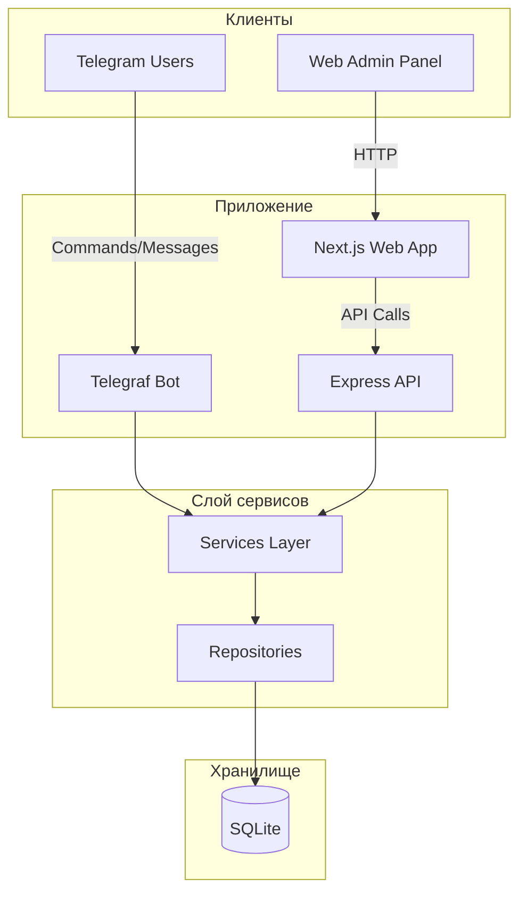
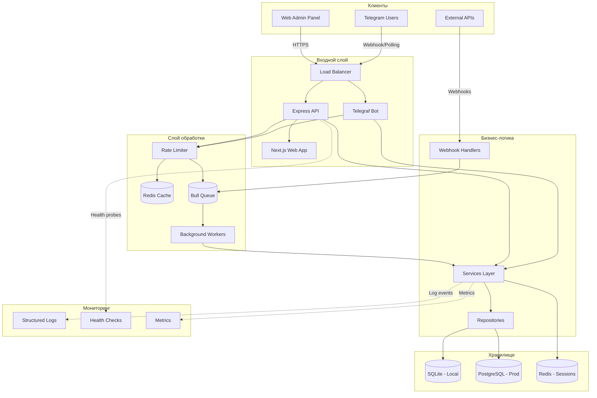

# План улучшения Telegram бота

## Обзор текущей архитектуры



## Целевая архитектура (улучшенная)



---

## Этап 1: Оптимизация производительности

### 1.1 Интеграция Redis

**Файлы для создания:**

- `src/config/redis.js` - конфигурация Redis
- `src/services/cache-service.js` - сервис кэширования
- `src/middleware/cache.js` - middleware для кэширования

**Зависимости:**

```bash
npm install ioredis
```

**Конфигурация (.env):**

```
REDIS_URL=redis://localhost:6379
REDIS_TTL_SESSION=3600
REDIS_TTL_CATALOG=300
REDIS_TTL_STATS=60
```

### 1.2 Оптимизация БД

**Существующие миграции:**

- `src/db/migrations/005_add_indexes.js` - уже добавлены базовые индексы

**Дополнительные индексы:**

```sql
-- Для пагинации и сортировки
CREATE INDEX IF NOT EXISTS idx_leads_created_at ON leads(created_at DESC);
CREATE INDEX IF NOT EXISTS idx_leads_status_created ON leads(status, created_at DESC);

-- Для поиска
CREATE INDEX IF NOT EXISTS idx_users_username ON users(username) WHERE username IS NOT NULL;
CREATE INDEX IF NOT EXISTS idx_users_created_at ON users(created_at DESC);

-- Для сообщений
CREATE INDEX IF NOT EXISTS idx_messages_conversation_created ON messages(conversation_id, created_at DESC);
```

### 1.3 Connection Pooling

**Для SQLite (better-sqlite3):**

- Уже используется WAL mode
- Добавить настройки в `src/db/sqlite.js`:

```javascript
// Оптимизации для конкурентного доступа
db.pragma("busy_timeout = 10000");
db.pragma("cache_size = -32000"); // 32MB cache
db.pragma("mmap_size = 268435456"); // 256MB mmap
```

---

## Этап 2: Расширенные интерактивные элементы

### 2.1 Пагинация каталога

**Обновление `src/ui/keyboards.js`:**

```javascript
function catalogKeyboardWithPagination(products, page = 0, perPage = 5) {
  const start = page * perPage;
  const pageItems = products.slice(start, start + perPage);

  const rows = pageItems.map((product) => [
    Markup.button.callback(
      `${product.is_active ? "✅" : "❌"} ${product.title}`,
      buildAction(ACTION_PREFIXES.CATALOG_PRODUCT, product.id),
    ),
  ]);

  // Pagination controls
  const nav = [];
  if (page > 0) {
    nav.push(Markup.button.callback("◀️ Назад", `catalog:page:${page - 1}`));
  }
  if (start + perPage < products.length) {
    nav.push(Markup.button.callback("Вперед ▶️", `catalog:page:${page + 1}`));
  }

  if (nav.length) rows.push(nav);
  rows.push([Markup.button.callback("Главное меню", ACTIONS.MENU_MAIN)]);

  return Markup.inlineKeyboard(rows);
}
```

### 2.2 Confirmation Dialogs

**Новый файл `src/ui/dialogs.js`:**

```javascript
const { Markup } = require("telegraf");

function confirmDialog(action, data, message = "Подтвердите действие:") {
  return {
    text: message,
    keyboard: Markup.inlineKeyboard([
      [
        Markup.button.callback("✅ Да", `confirm:yes:${action}:${data}`),
        Markup.button.callback("❌ Нет", `confirm:no:${action}:${data}`),
      ],
    ]),
  };
}

module.exports = { confirmDialog };
```

---

## Этап 3: Интеграция с внешними API

### 3.1 Модуль Webhook интеграций

**Новая структура:**

```
src/integrations/
├── index.js
├── crm/
│   ├── base.js
│   ├── amo-crm.js
│   └── bitrix24.js
├── payment/
│   ├── base.js
│   ├── stripe.js
│   └── yookassa.js
└── webhooks/
    ├── handler.js
    └── validators.js
```

**Базовый класс интеграции (`src/integrations/base.js`):**

```javascript
class BaseIntegration {
  constructor(config) {
    this.config = config;
    this.name = this.constructor.name;
  }

  async validateWebhook(payload, signature) {
    throw new Error("Not implemented");
  }

  async sendLead(leadData) {
    throw new Error("Not implemented");
  }

  async syncStatus(leadId, status) {
    throw new Error("Not implemented");
  }
}

module.exports = { BaseIntegration };
```

### 3.2 Поддержка PostgreSQL

**Новый файл `src/db/postgres.js`:**

```javascript
const { Pool } = require("pg");

function createPostgresPool() {
  return new Pool({
    connectionString: process.env.DATABASE_URL,
    max: 20,
    idleTimeoutMillis: 30000,
    connectionTimeoutMillis: 2000,
  });
}

module.exports = { createPostgresPool };
```

**Условное использование в `index.js`:**

```javascript
const dbType = process.env.DB_TYPE || "sqlite";
const db = dbType === "postgres" ? createPostgresPool() : createDatabase();
```

---

## Этап 4: Улучшенное логирование и обработка ошибок

### 4.1 Winston Logger

**Установка:**

```bash
npm install winston winston-daily-rotate-file
```

**Новый файл `src/utils/logger-enhanced.js`:**

```javascript
const winston = require("winston");
const DailyRotateFile = require("winston-daily-rotate-file");

const { combine, timestamp, json, errors, printf } = winston.format;

const levels = {
  error: 0,
  warn: 1,
  info: 2,
  http: 3,
  verbose: 4,
  debug: 5,
  silly: 6,
};

const logger = winston.createLogger({
  level: process.env.LOG_LEVEL || "info",
  levels,
  format: combine(timestamp(), errors({ stack: true }), json()),
  defaultMeta: {
    service: "telegram-bot",
    environment: process.env.NODE_ENV,
  },
  transports: [
    new DailyRotateFile({
      filename: "logs/error-%DATE%.log",
      level: "error",
      datePattern: "YYYY-MM-DD",
      zippedArchive: true,
      maxSize: "20m",
      maxFiles: "14d",
    }),
    new DailyRotateFile({
      filename: "logs/combined-%DATE%.log",
      datePattern: "YYYY-MM-DD",
      zippedArchive: true,
      maxSize: "20m",
      maxFiles: "30d",
    }),
  ],
});

// Console transport для разработки
if (process.env.NODE_ENV !== "production") {
  logger.add(
    new winston.transports.Console({
      format: printf(({ level, message, timestamp, ...meta }) => {
        return `${timestamp} [${level.toUpperCase()}]: ${message} ${Object.keys(meta).length ? JSON.stringify(meta, null, 2) : ""}`;
      }),
    }),
  );
}

module.exports = { logger };
```

### 4.2 Error Handling Middleware

**Новый файл `src/middleware/error-handler.js`:**

```javascript
const { logger } = require("../utils/logger-enhanced");

function errorHandler(error, req, res, next) {
  const errorId = generateErrorId();

  logger.error("Unhandled error", {
    errorId,
    error: error.message,
    stack: error.stack,
    path: req.path,
    method: req.method,
    userId: req.user?.id,
  });

  // Don't leak error details in production
  const isDev = process.env.NODE_ENV === "development";

  res.status(error.status || 500).json({
    success: false,
    error: {
      message: isDev ? error.message : "Internal server error",
      code: error.code || "INTERNAL_ERROR",
      errorId,
    },
  });
}

module.exports = { errorHandler };
```

---

## Этап 5: Асинхронная обработка с Bull

### 5.1 Настройка очередей

**Установка:**

```bash
npm install bull ioredis
```

**Новый файл `src/queues/index.js`:**

```javascript
const Queue = require("bull");
const { logger } = require("../utils/logger-enhanced");

const redisConfig = {
  redis: {
    host: process.env.REDIS_HOST || "localhost",
    port: process.env.REDIS_PORT || 6379,
  },
};

// Очередь для отправки сообщений
const messageQueue = new Queue("message-sending", redisConfig);

// Очередь для обработки вебхуков
const webhookQueue = new Queue("webhook-processing", redisConfig);

// Очередь для batch-операций
const batchQueue = new Queue("batch-operations", redisConfig);

// Обработчики
messageQueue.process("send-message", 5, async (job) => {
  const { chatId, text, options } = job.data;
  // Логика отправки сообщения
  logger.info("Processing send-message job", { jobId: job.id, chatId });
});

webhookQueue.process("process-webhook", 10, async (job) => {
  const { integration, payload } = job.data;
  logger.info("Processing webhook", { jobId: job.id, integration });
});

module.exports = {
  messageQueue,
  webhookQueue,
  batchQueue,
};
```

### 5.2 Graceful Shutdown

**Обновление `index.js`:**

```javascript
async function gracefulShutdown(signal) {
  logger.info(`Received ${signal}, starting graceful shutdown...`);

  // Close queues
  await messageQueue.close();
  await webhookQueue.close();
  await batchQueue.close();

  // Close HTTP server
  if (httpServer) {
    await new Promise((resolve) => httpServer.close(resolve));
  }

  // Stop bot
  if (bot) {
    await bot.stop(signal);
  }

  // Close database
  if (db) {
    await db.close();
  }

  logger.info("Graceful shutdown completed");
  process.exit(0);
}
```

---

## Этап 6: Расширенная админ-панель

### 6.1 Ролевая модель

**Миграция `src/db/migrations/008_user_roles.js`:**

```javascript
function migrate(db) {
  // Добавляем колонку role
  db.exec(`
    ALTER TABLE users ADD COLUMN role TEXT DEFAULT 'client';
    ALTER TABLE users ADD COLUMN permissions TEXT DEFAULT '{}';
  `);

  // Обновляем существующего админа
  db.exec(`
    UPDATE users 
    SET role = 'admin', 
        permissions = '{"all": true}' 
    WHERE telegram_id = (SELECT value FROM config WHERE key = 'admin_id');
  `);

  // Создаем таблицу ролей
  db.exec(`
    CREATE TABLE IF NOT EXISTS roles (
      id INTEGER PRIMARY KEY AUTOINCREMENT,
      name TEXT UNIQUE NOT NULL,
      permissions TEXT NOT NULL,
      created_at DATETIME DEFAULT CURRENT_TIMESTAMP
    );

    INSERT INTO roles (name, permissions) VALUES
    ('admin', '{"all": true}'),
    ('manager', '{"leads": ["read", "write"], "users": ["read"], "broadcast": true}'),
    ('operator', '{"leads": ["read", "write"], "users": ["read"]}');
  `);
}

module.exports = { migrate };
```

### 6.2 Middleware авторизации

**Новый файл `src/middleware/rbac.js`:**

```javascript
function requirePermission(permission) {
  return async (ctx, next) => {
    const userRole = ctx.state.user?.role || "client";
    const permissions = await getRolePermissions(userRole);

    if (!permissions[permission] && !permissions.all) {
      return ctx.reply("❌ У вас нет доступа к этой функции");
    }

    return next();
  };
}

function requireAdmin(ctx, next) {
  if (ctx.state.user?.role !== "admin") {
    return ctx.reply("❌ Эта команда доступна только администраторам");
  }
  return next();
}

module.exports = { requirePermission, requireAdmin };
```

---

## Этап 7: Docker и инфраструктура

### 7.1 Обновленный docker-compose.yml

```yaml
version: "3.8"

services:
  # Redis для кэширования и очередей
  redis:
    image: redis:7-alpine
    container_name: bot_redis
    restart: unless-stopped
    volumes:
      - redis_data:/data
    command: redis-server --appendonly yes --maxmemory 256mb --maxmemory-policy allkeys-lru
    healthcheck:
      test: ["CMD", "redis-cli", "ping"]
      interval: 10s
      timeout: 3s
      retries: 3

  # Бот + API
  bot:
    build:
      context: .
      dockerfile: Dockerfile
      target: production
    container_name: bot_app
    restart: unless-stopped
    ports:
      - "${PORT:-3000}:3000"
    environment:
      - NODE_ENV=production
      - DB_TYPE=${DB_TYPE:-sqlite}
      - DATABASE_URL=${DATABASE_URL:-}
      - REDIS_URL=redis://redis:6379
      # ... остальные переменные
    volumes:
      - ./data:/app/data
    depends_on:
      redis:
        condition: service_healthy
    deploy:
      resources:
        limits:
          cpus: "1"
          memory: 512M
        reservations:
          cpus: "0.25"
          memory: 128M

  # Worker для фоновых задач
  worker:
    build:
      context: .
      dockerfile: Dockerfile
      target: production
    container_name: bot_worker
    restart: unless-stopped
    command: node src/workers/index.js
    environment:
      - NODE_ENV=production
      - REDIS_URL=redis://redis:6379
      - DATABASE_URL=${DATABASE_URL:-}
    depends_on:
      - redis
      - bot
    deploy:
      resources:
        limits:
          cpus: "0.5"
          memory: 256M

volumes:
  redis_data:
```

### 7.2 Оптимизированный Dockerfile

```dockerfile
# Build stage
FROM node:20-alpine AS builder
WORKDIR /app
COPY package*.json ./
RUN npm ci --only=production && npm cache clean --force

# Production stage
FROM node:20-alpine AS production
RUN apk add --no-cache dumb-init

WORKDIR /app

# Create non-root user
RUN addgroup -g 1001 -S nodejs && \
    adduser -S nodejs -u 1001

# Copy dependencies
COPY --from=builder --chown=nodejs:nodejs /app/node_modules ./node_modules

# Copy app files
COPY --chown=nodejs:nodejs . .

USER nodejs

EXPOSE 3000

HEALTHCHECK --interval=30s --timeout=3s --start-period=10s --retries=3 \
  CMD node -e "require('http').get('http://localhost:3000/healthz', (r) => r.statusCode === 200 ? process.exit(0) : process.exit(1))"

ENTRYPOINT ["dumb-init", "--"]
CMD ["node", "index.js"]
```

---

## Этап 8: Мониторинг и алерты

### 8.1 Health Checks

**Новый файл `src/web/routes/health.js`:**

```javascript
const express = require("express");
const router = express.Router();

router.get("/healthz", async (req, res) => {
  const checks = {
    database: await checkDatabase(),
    redis: await checkRedis(),
    bot: await checkBot(),
  };

  const isHealthy = Object.values(checks).every((c) => c.status === "ok");

  res.status(isHealthy ? 200 : 503).json({
    status: isHealthy ? "healthy" : "unhealthy",
    timestamp: new Date().toISOString(),
    checks,
  });
});

router.get("/readyz", async (req, res) => {
  // Readiness probe - проверяем готовность принимать трафик
  const ready = await checkReadiness();
  res.status(ready ? 200 : 503).json({ ready });
});

module.exports = router;
```

### 8.2 Метрики (Prometheus)

**Установка:**

```bash
npm install prom-client
```

**Новый файл `src/monitoring/metrics.js`:**

```javascript
const client = require("prom-client");

// Создаем регистр
const register = new client.Registry();

// Метрики
const botMessagesTotal = new client.Counter({
  name: "bot_messages_total",
  help: "Total number of messages processed",
  labelNames: ["type", "status"],
});

const leadProcessingDuration = new client.Histogram({
  name: "lead_processing_duration_seconds",
  help: "Lead processing duration in seconds",
  buckets: [0.1, 0.5, 1, 2, 5],
});

const activeUsersGauge = new client.Gauge({
  name: "bot_active_users",
  help: "Number of active users in last hour",
});

register.registerMetric(botMessagesTotal);
register.registerMetric(leadProcessingDuration);
register.registerMetric(activeUsersGauge);

module.exports = {
  register,
  botMessagesTotal,
  leadProcessingDuration,
  activeUsersGauge,
};
```

---

## Этап 9: Документация

### 9.1 API Documentation (Swagger)

**Установка:**

```bash
npm install swagger-jsdoc swagger-ui-express
```

**Новый файл `src/web/swagger.js`:**

```javascript
const swaggerJsdoc = require("swagger-jsdoc");
const swaggerUi = require("swagger-ui-express");

const options = {
  definition: {
    openapi: "3.0.0",
    info: {
      title: "Telegram Bot API",
      version: "1.0.0",
      description: "API для управления Telegram ботом",
    },
    servers: [
      {
        url: "/api",
        description: "API server",
      },
    ],
  },
  apis: ["./src/web/routes/*.js"],
};

const specs = swaggerJsdoc(options);

module.exports = { swaggerUi, specs };
```

---

## Приоритеты реализации

### Phase 1 (Критический): Базовая оптимизация

- [ ] Redis кэширование сессий
- [ ] Улучшенное логирование (Winston)
- [ ] Graceful shutdown
- [ ] Health checks

### Phase 2 (Важно): Масштабируемость

- [ ] Bull очереди для сообщений
- [ ] PostgreSQL поддержка
- [ ] Ролевая модель
- [ ] Docker оптимизация

### Phase 3 (Желательно): Расширенные функции

- [ ] CRM интеграции
- [ ] Payment интеграции
- [ ] Prometheus метрики
- [ ] Advanced пагинация

---

## Оценка ресурсов

| Компонент  | CPU       | RAM         | Диск     |
| ---------- | --------- | ----------- | -------- |
| Bot + API  | 0.5-1     | 256-512MB   | 1GB      |
| Worker     | 0.25-0.5  | 128-256MB   | -        |
| Redis      | 0.1       | 256MB       | 1GB      |
| PostgreSQL | 0.5       | 512MB       | 10GB     |
| **Всего**  | **1.5-2** | **1-1.5GB** | **12GB** |

---

## Security Checklist

- [ ] Rate limiting на все endpoints
- [ ] Input validation для всех входов
- [ ] SQL injection protection (parameterized queries)
- [ ] XSS protection для web
- [ ] CSRF tokens для форм
- [ ] API key rotation
- [ ] Secret management (не в коде)
- [ ] HTTPS only (production)
- [ ] Security headers (Helmet)
- [ ] Dependency auditing (npm audit)
